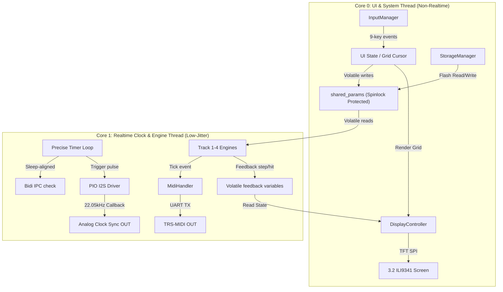
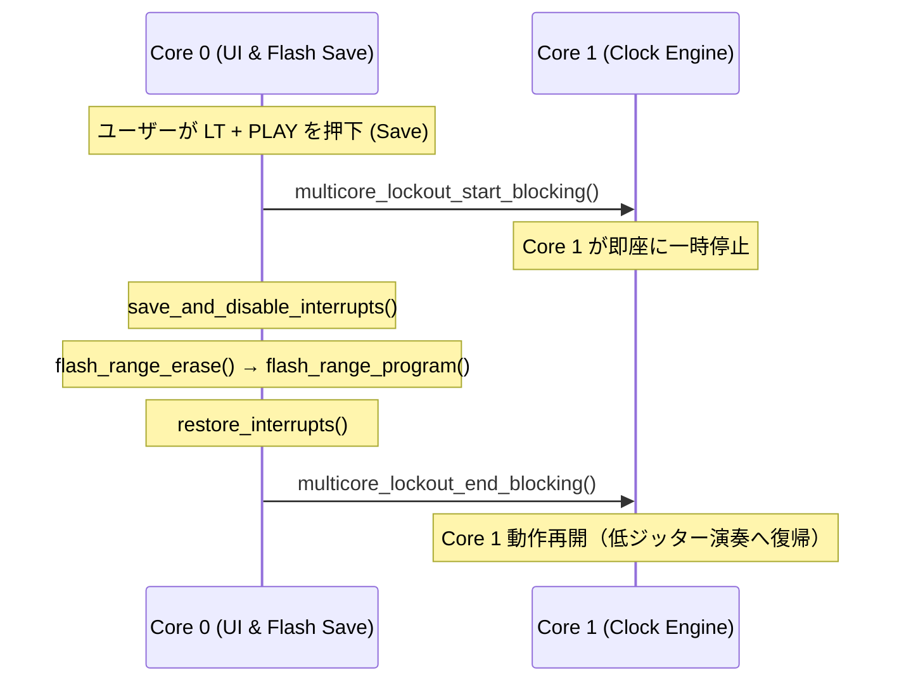

# Generative MIDI Sequencer — Software Architecture

本ドキュメントでは、RP2040 デュアルコアアーキテクチャを活用したソフトウェア設計について定義します。

---

## 1. デュアルコア・プロセッシングモデル

RP2040に搭載された2基の ARM Cortex-M0+ コアを完全に独立させ、それぞれ排他的なタスクを担当させています。



### Core 0: ユーザーインターフェース & システム統括

非リアルタイムで、画面描画等の比較的重い処理を担当します。

- **`InputManager`**: 9つのキースイッチを GPIO スキャン。デバウンス処理、単押し・長押し・Modifier キー（`LT`）の状態判定。
- **`DisplayController`**: SPI0（SCK: GP18, MOSI: GP19, CS: GP17, DC: GP20, RST: GP16）経由で 320x240 ILI9341 を駆動。差分描画（Dirty Rect）エンジンでSPI負荷を最小化。
- **`StorageManager`**: フラッシュメモリ（QSPI）最終セクター（`0xFFF000`）への設定データ保存／展開。

### Core 1: リアルタイム・シーケンス & クロック同期

`time_us_64()` ハードウェアタイマーベースのマイクロ秒精度ポーリングループで動作。

- **Master Clock Generator**: `shared_bpm` に基づき 24 PPQN のマスタークロック信号を生成。
- **Generative Sequence Coordinator**: 4系統の `Track` インスタンスを保有。マスタークロックごとに共有メモリからパラメータをシャドウイングして演奏計算を実行。
- **`MidiHandler`**: UART0 TX (GP0) から 31,250 bps のシリアル MIDI 信号を送信。
- **PIO I2S Analog Sync**: 22.05 kHz タイマーコールバックから PIO I2S FIFO にサンプルを供給。MIDI クロックと同期したアナログパルス信号を出力。

---

## 2. スピンロック付き共有メモリ通信モデル (Spinlock-Protected IPC)

Core 0 と Core 1 間のパラメータ通信には、RP2040 のハードウェア・スピンロック (`spin_lock_t*`) による排他制御を採用しています。

```cpp
// Core 0 (UI) から Core 1 (Engine) への共有パラメータ構造体
struct TrackParams {
    volatile uint8_t length;      // ループステップ数 (1〜32)
    volatile uint8_t density;     // 発音パルス数 (0〜Length)
    volatile uint8_t shift;       // ユークリッドシフト (0〜Length)
    volatile uint8_t mutation;    // Turing Machine 変異確率 (0〜100%)
    volatile uint8_t root_note;   // 量子化ルート音 (MIDI値 0〜127)
    volatile uint8_t scale_type;  // 量子化スケールID (ScaleType enum)
    volatile uint8_t clock_divide;// クロック分周比
    volatile uint8_t probability; // 発音確率 (0〜100%) — Euclidean ヒット時の間引き確率
    volatile uint8_t gate;        // ゲート長さ (10〜100%, 0=SLモード)
    volatile bool is_muted;       // ミュート状態
};

// Core 1 から Core 0 への状態フィードバック
extern volatile uint8_t shared_current_step[4]; // 各トラックの再生中のカレントステップ
extern volatile bool    shared_step_hit[4];     // 発音ヒットの瞬間 (UI フラッシュ用)
extern volatile bool    sequencer_playing;      // グローバル再生・停止フラグ
extern volatile uint16_t shared_bpm;           // リアルタイム可変BPM値
extern volatile uint32_t shared_master_ticks;  // 積算マスタークロック
```

### IPC データ安全性保証

1. **スピンロック排他制御**: Core 0 でのパラメータ変更時、および Core 1 でのシャドウイングコピー時にスピンロックで保護。マルチバイト構造体のデータティアリングを完全防止。
2. **ダブルバッファリング描画**: `update_ui_dashboard()` は描画開始時にスピンロックで `shared_params` を `draw_params` バッファに一括コピーし、即座にロック解放。画面描画中の遅延がリアルタイムエンジンに影響しない。
3. **スカラーのアトミック読み書き**: `shared_bpm` や `sequencer_playing` などは CPU 1命令で完結するため、ロック不要で高速アクセス。
4. **Core 1 キャッシュ機構**: Core 1 は `shared_params` を 4ms ごとにローカルキャッシュに反映。クロック tick 直前のスピンロック取得を排除し、レイテンシジッターを最小化。

---

## 3. クラス設計と詳細仕様 (C++ Class Reference)

### 3.1. `EuclideanGenerator`

Bresenham アルゴリズムベースの O(1) ユークリッドトリガー計算。動的メモリ確保なし。

```cpp
class EuclideanGenerator {
public:
    bool calculate_step(uint8_t current_step, uint8_t steps,
                        uint8_t pulses, uint8_t shift);
};
```

### 3.2. `NoteGenerator` (Turing Machine)

32-bit シフトレジスタをシミュレートし、変異確率に基づいてビットを攪乱。生成した CV 値（0〜255）を音楽的スケールへ量子化します。

```cpp
enum ScaleType {
    SCALE_CHROMATIC = 0,   // 半音階
    SCALE_NATURAL_MINOR,   // ナチュラルマイナー
    SCALE_PHRYGIAN,        // フリジアン
    SCALE_DORIAN,          // ドリアン
    SCALE_MINOR_PENTATONIC,// マイナーペンタトニック
    SCALE_HUNGARIAN_MINOR, // ハンガリアンマイナー
    SCALE_WHOLE_TONE,      // 全音音階
    SCALE_BLUES,           // ブルーススケール
    SCALE_MAJOR_PENTATONIC,// メジャーペンタトニック
    SCALE_COUNT            // = 9
};

class NoteGenerator {
private:
    uint32_t shift_register; // 32-bit Turing Machine レジスタ（初期値 0x9E3779B9）
public:
    void reset();
    void randomize_seed();
    // シフトレジスタを1ステップ進め、mutation_rate の確率でビット反転
    uint8_t step(uint8_t mutation_rate, uint8_t length = 16, bool* mutated = nullptr);
    // CV値を指定スケール・ルート音に量子化 (octave_range=4 で4オクターブ展開)
    static uint8_t quantize(uint8_t raw_cv, uint8_t root_note,
                            ScaleType scale_type, uint8_t octave_range = 4);
};
```

### 3.3. `Track`

リズム・ピッチ生成と、発音確率（PRB）ゲート、ベロシティダイナミクス、非同期ゲート長制御のライフサイクルを統括するコアクラスです。

```cpp
class Track {
private:
    EuclideanGenerator rhythm;
    NoteGenerator pitch;
    uint8_t current_step;
    uint8_t length, density, shift, mutation_rate, root_note;
    ScaleType scale_type;
    uint8_t clock_divide;
    uint8_t prob_rate;    // 0〜100: 発音確率 (Elektron スタイル)
    uint8_t gate_rate;    // 10〜100 or 0(SLモード)
    bool is_muted;

    // 非同期ノートスケジューラ
    uint64_t pending_note_on_time;
    uint8_t  pending_note;
    uint8_t  pending_velocity; // Turing Machine 連動の動的ベロシティ
    bool     has_pending_note;
    uint64_t pending_note_off_time;
    bool     has_pending_note_off;

public:
    void set_params(uint8_t len, uint8_t dens, uint8_t shf, uint8_t mut,
                    uint8_t root, ScaleType scale, uint8_t divide,
                    uint8_t prob, uint8_t gt, bool muted);
    // クロック tick ごとにシーケンスを進め、PRB ゲートを通過した時のみ Note-On をスケジュール
    // 戻り値: true = 実際に発音スケジュール済み (UI フラッシュ用)
    bool tick(uint32_t master_tick, uint32_t bpm, MidiHandler& midi);
    void update_scheduled_events(uint32_t bpm, MidiHandler& midi);
    void silence(MidiHandler& midi);
};
```

#### ベロシティ・ダイナミクス エンジン

`tick()` 内で発音スケジュール時に自動計算されます（UI パラメータ不要）。

```
base_vel = 50 + ((raw_cv >> 1) & 0x3F)  →  50〜113

Step 0 (ダウンビート) : +14  →  64〜127
Step length/4 倍数位置: +7   →  57〜118
その他オフビート      :  +0  →  50〜113
```

`raw_cv` は Turing Machine のシフトレジスタから来るため、MUT=0（ロック）時はベロシティも固定パターンを繰り返し、MUT が上がるにつれ有機的に変化します。

#### 発音確率（PRB）ゲート

```cpp
bool fire = (prob_rate >= 100) || ((get_rand_32() % 100) < prob_rate);
if (fire) {
    // ... Note-On スケジュール
}
// Turing Machine は fire の結果に関わらず常に pitch.step() を実行
// → 音列の継続性を保ちながら発音だけ確率的に間引く
```

### 3.4. `StorageManager`

RP2040 のフラッシュ保護仕様に適合した不揮発性ストレージマネージャー。マジックナンバーとチェックサムで整合性検証。

```cpp
class StorageManager {
    static const uint32_t FLASH_TARGET_OFFSET = (16 * 1024 * 1024) - 4096; // 最終4KBセクター
public:
    bool save(const TrackParams params[4]); // 消去 → 書き込み → チェックサム
    bool load(TrackParams params[4]);       // マジック検証 → チェックサム検証 → 展開
};
```

---

## 4. XIPキャッシュクラッシュを回避するマルチコア・ロックアウト

RP2040 は XIP（Execute In Place）方式でフラッシュからコードを実行します。フラッシュ書き込み中に Core 1 がフラッシュへアクセスすると **HardFault** が発生するため、Pico SDK 標準の **Multicore Lockout API** を使用しています。



1. Core 1 は起動時に `multicore_lockout_victim_init()` でロックアウト受付リスナーを登録。
2. Core 0 が `multicore_lockout_start_blocking()` を呼び出すと Core 1 はハードウェアレベルで即時停止。
3. フラッシュ消去・書き込みを安全に実行。
4. `multicore_lockout_end_blocking()` で Core 1 が停止箇所から再開。

---

## 5. UI レンダリングシステム (Dirty Rect 差分描画)

SPI バスの帯域を節約するため、変化のあったセルだけを再描画する **Dirty Rect エンジン** を採用しています。

```cpp
struct UICellCache {
    uint8_t length, density, shift, mutation;
    uint8_t probability, gate, root_note, scale_type;
    bool is_muted, is_focused;
    uint8_t clock_divide;
};
static UICellCache cell_cache[4][10]; // 4トラック × 10列
```

- `cell_cache` と現在の `draw_params` を比較して dirty フラグを立て、変化のあったセルのみ `draw_single_cell()` で再描画。
- ステップレーン（`draw_track_steps()`）は前ステップと現ステップの2セルのみ差分更新。SPI 負荷を最大 95% 削減。

### パラメータカラムヘッダー アイコン一覧

各カラムのヘッダーには 16×16 ピクセルアートアイコンを表示します。

| 列 | アイコン変数 | 意匠 |
|:-:|:--|:--|
| 1 LEN | `icon_len_8x8` | ループ範囲ブラケット `[  ]` |
| 2 DEN | `icon_den_8x8` | 4点トリガー密度ドット |
| 3 SHF | `icon_shf_8x8` | オフセット矢印 |
| 4 MUT | `icon_mut_8x8` | 二重螺旋 DNA |
| 5 PRB | `icon_prb_8x8` | 4段の確率バーグラフ（段階的に短くなる水平バー） |
| 6 GAT | `icon_gat_8x8` | ゲートパルス矩形波 |
| 7 ROT | `icon_rot_8x8` | アンカー・クラウン |
| 8 SCL | `icon_scl_8x8` | 音階の階段 |
| 9 RND | `icon_rnd_8x8` | サイコロ（シアン強調） |
